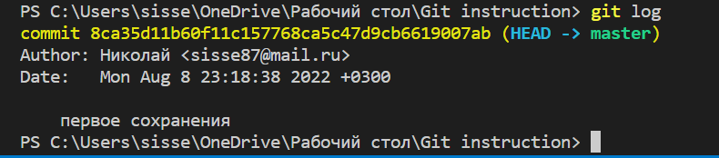

1. Первым делом необходимо создать репозиторий в Git'е. Это делается с командой "git init". 

2. Командой "git status" можно проверить в каком статусе сейчас находится файл. Так как не было добавлений и фиксаций/сохранений название папки будет выделен красным цветом, что будет означать - изменения не проиндексированы.

3. Чтобы проиндексировать/добавить изменения нам нужна команда "git add "название папки"".

4. После индексации изменений, нам нужно их сохранить в данном слепке во внутренней базе данных. Это делается с помощью команды "git commit". Добавляя в конец команды (-m "название сохранения"), чтобы легче было в дальнейшем понимать что именно сохранилось в данном коммите.

5. Эти две команды ("git add" и "git commit") можно объеденить в одну: "git commit -am "название сохранения""

6. Командой "git log" можно просматривать журнал изменений. Пример на картинке:

Командой "git checkout" можно переходить по сохраненным версиям 

"Git checkout master" возвращает в актуальную рабочую версия документа.

